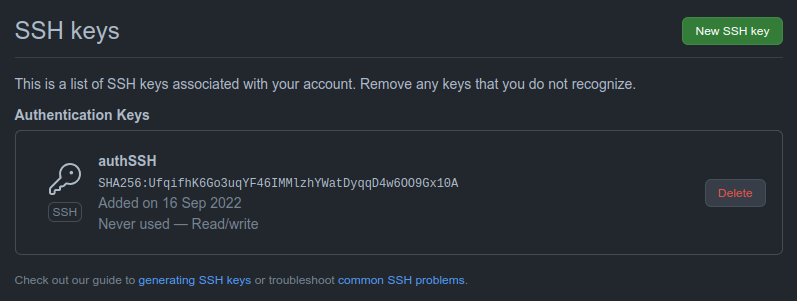

# Configuración de git
Para la configuración de git, se ha creado un par de claves con ssh-keygen en local y se ha utilizado la clave publica para registrarla en Github. Con esto conseguimos que, cada vez que subamos algo, no haga falta meter las credenciales ya que con dichas claves confirmamos la identidad.

.